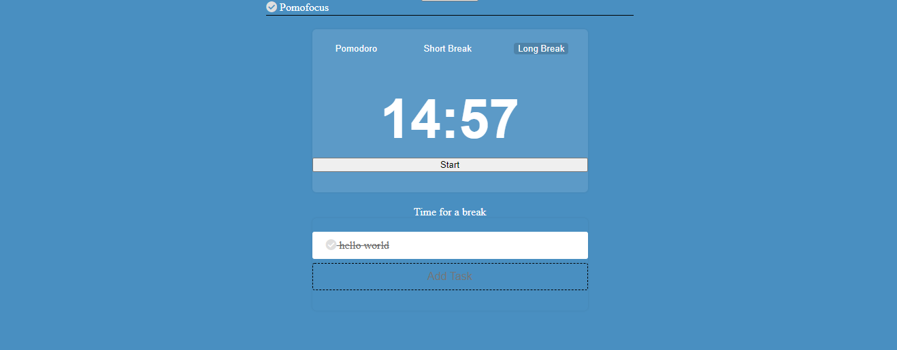

# Pomodoro timer: Practical JavaScript

A refactor of the Practical JavaScript pomodoro timer

---

## Data

>

---

## User Story Dependencies

---

## WIREFRAME

---

## 0.Setup

- Start a repo.
- turn on the Github page
- Design a simple wireframe to set guidelines for UI/UX design.
- Devise a development strategy.

---

## 1. Initialize Application

**As a user I want to see the home page when I load the site**

- a start button
- a button with pomodoro
- a button with long break
- a button with a short break
- a clock to define to display the time
- an input to add the task
- ...

### REPO

- This user story is developed on branch `devstra`.
- This branch is merged to `master` branch after completion.

### Task A : creating the buttons

- i will create a branch `buttons`
- create file init.js
- create the file task.js (create a class Task that will be exported)
- create the file timer.js (create a class Timer that will also exported)
- after i will merge this branch to `master` 

### Task B

- create a branch `styles`
- add some css to style de app
- merge this branch to `master`

### Technologies used

- HTML
- CSS
- JavaScript
- Bootstrap
- ..
---
